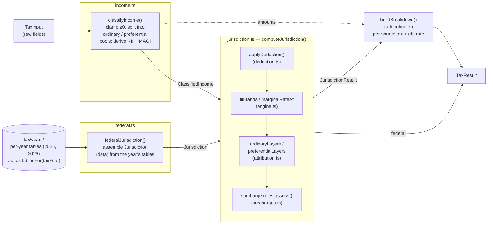
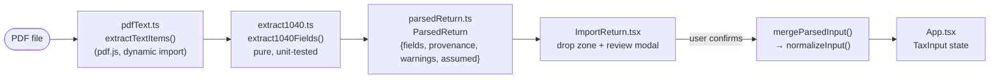

# Architecture

A single-page React app with no backend. All computation is pure, synchronous,
client-side TypeScript; the only I/O is `localStorage` for input and saved-scenario
persistence, plus reading a dropped Form 1040 PDF for import (see
[PDF 1040 import pipeline](#pdf-1040-import-pipeline)) — both stay local to the browser.

The design splits cleanly into two halves:

- **`src/tax/`** — a pure, framework-free tax engine. No React, no DOM. Takes a
  `TaxInput`, returns a `TaxResult`. Every module here is independently unit-tested.
- **`src/` + `src/components/`** — the React UI. Holds the input state, calls the
  engine, and renders the `TaxResult` as towers, indicators, and breakdowns.

The seam between them is two plain data types: `TaxInput` in, `TaxResult` out
(both in `src/tax/types.ts`). The UI never does tax math; the engine never
touches the DOM.

## System overview

The whole app is a pure function of the input: `App` keeps a single
`TaxInput` in state, memoizes `calculateTax(input)` into a `TaxResult`, and hands
that result to every visualization. The `TaxInput` carries the filing status and
the selected `taxYear` (both chosen in `IncomeForm`) alongside the income fields.
Editing the form replaces the input, which recomputes the result, which re-renders
the views. The input — and any named scenarios saved from it — are mirrored to
`localStorage` on every change so a reload restores them, and it can also be encoded
into a share link (the year rides along as the `y` param).

## The tax engine pipeline

`calculateTax` (in `calculate.ts`) is a thin orchestrator. It wires together
focused modules, each responsible for one step:

### Step by step

1. **`classifyIncome`** (`income.ts`) — nets the two capital-gains fields against
   each other (see [Capital-gains netting](#capital-gains-netting--the-net-loss-deduction)
   below), clamps every other source to ≥0, and splits the result into two pools:
   **ordinary** (wages, interest, non-qualified dividends, short-term gains) and
   **preferential** (qualified dividends, long-term gains). The capital-gains fields
   are the only ones that may arrive negative (a loss); the taxable pools it produces
   are always ≥0, and any residual net loss is carried out separately. Also derives
   net investment income (NII) for the surcharges.

2. **`federalJurisdiction`** (`federal.ts`) — assembles a `Jurisdiction`: a plain
   data object with an ordinary bracket ladder, a deduction (the standard amount
   for the filing status, or a custom override), a
   preferential (0/15/20%) capital-gains ladder, and a list of surcharge rules —
   all pulled from the selected year's tables (`src/tax/years/`, resolved by
   `taxTablesFor(input.taxYear)`) for the given filing status.

3. **`computeJurisdiction`** (`jurisdiction.ts`) — the core. Runs the classified
   income through one jurisdiction's rules:
   - the **net-capital-loss deduction** — a residual net loss reduces income
     (ordinary first, then preferential) before the income deduction, capped and
     carried forward per [Capital-gains netting](#capital-gains-netting--the-net-loss-deduction).
     This is finalized here, not in `classifyIncome`, because only the jurisdiction
     knows the filing-status cap and the taxable income that limits the loss.
   - `applyDeduction` (`deduction.ts`) — deduction eats ordinary income first;
     any remainder shields preferential income proportionally.
   - `fillBands` / `marginalRateAt` (`engine.ts`) — the band arithmetic: fill an
     income range into rate bands and read off the marginal rate at a position.
     Preferential income stacks _on top_ of ordinary taxable income.
   - `ordinaryLayers` / `preferentialLayers` (`attribution.ts`) — slice each
     source into taxable layers positioned in the stack, for the towers.
   - surcharge rules (`surcharges.ts`) — each `SurchargeRule` (NIIT, Additional
     Medicare) owns its `assess()`, its `marginalRate()`, and an `attribution`
     descriptor, so next-dollar behavior and per-source attribution can't drift
     from assessment.

4. **`buildBreakdown`** (`attribution.ts`) — combines per-layer income tax with
   the surcharges, attaching each surcharge's dollars per its declared
   `attribution` (Medicare → wages; NIIT distributed across investment sources)
   into a per-source amount / tax / effective-rate table.

The assembled `TaxResult` nests the federal figures under `result.federal`
(a `JurisdictionResult`) plus the cross-jurisdiction totals.

## Capital-gains netting & the net-loss deduction

Short- and long-term capital results don't just each get taxed in place — they net
against each other, and a leftover _net loss_ offsets other income. This is the one
piece of the engine whose rules come straight from the tax code (IRC §1211/§1212/§1222,
Schedule D), so it's worth spelling out. The work is split across two modules by what
each one can know:

- **`nettedCapitalGains(shortTerm, longTerm)`** (`income.ts`) — pure §1222 netting, and
  nothing else. The two inputs are already each period's _net_ figure (Schedule D nets
  within a period first). Either may be negative (a loss). It returns the taxable gain
  per pool plus any residual loss, split by holding-period character:

  | net ST | net LT | taxable ST | taxable LT | residual loss    | rule                                                     |
  | ------ | ------ | ---------- | ---------- | ---------------- | -------------------------------------------------------- |
  | +100   | +1000  | 100        | 1000       | —                | two gains, no interaction                                |
  | −100   | +1000  | 0          | 900        | —                | ST loss absorbs into LT gain; survivor is **long-term**  |
  | +1000  | −100   | 900        | 0          | —                | LT loss absorbs into ST gain; survivor is **short-term** |
  | −1000  | +1000  | 0          | 0          | —                | exact wash                                               |
  | +100   | −1000  | 0          | 0          | 900 LT           | net loss keeps the **loss leg's** character              |
  | −100   | −1000  | 0          | 0          | 100 ST + 1000 LT | two losses; each carries on its own character            |

  A surviving _gain_ keeps the character of the **gain** leg; a surviving _loss_ keeps
  the character of the **loss** leg. Qualified dividends are deliberately not an input,
  so a capital loss can never offset them.

- **`computeJurisdiction`** (`jurisdiction.ts`) — turns that residual loss into the
  actual §1211(b) deduction and §1212(b) carryover, which it can only size once the
  filing-status cap and taxable income are known:

  1. **`netCapitalLoss`** = short-term + long-term residual loss (both ≥0 from step above).
  2. **`preLossTaxable`** = `max(0, grossOrdinary + grossPreferential − deduction)`
     — the taxable income there would be with no loss at all.
  3. **`lossDeduction`** = `min(netCapitalLoss, capitalLossLimit, preLossTaxable)`. The
     loss is limited by _both_ the annual filing-status cap (`capitalLossLimit`, $3,000 /
     $1,500 MFS) _and_ available taxable income — it can't drive taxable income below zero.
     Matching the IRS _Capital Loss Carryover Worksheet_, the limit is taxable income
     **after** the deduction (Form 1040 line 15), so a loss against income already
     covered by the deduction is fully _carried forward_, not spent.
  4. **Apply it, ordinary side first.** `lossAbsorbedOnOrdinary` comes off the ordinary
     pool; only the part that exceeds all ordinary income (rare — under ~$3k of ordinary
     income) spills onto the preferential pool. The income deduction then applies on top
     of the loss-reduced income, so total taxable income = `gross − lossDeduction − deduction`.
  5. **Carryover** (§1212(b)) = the residual loss minus what the deduction consumed,
     **short-term used first**.
  6. **MAGI** (the NIIT threshold basis) is reduced by the full `lossDeduction` — the loss
     reduces AGI, so a net loss can pull income under the NIIT threshold. (The income
     deduction does _not_ reduce AGI, so it isn't subtracted here.)

  Per-source attribution then divides the loss the same way for the towers: the ordinary
  layers absorb `deductionOnOrdinary + lossAbsorbedOnOrdinary` from the bottom, and the
  preferential layers are shielded by `preferentialShieldFraction` (derived from _gross_
  preferential income so the per-source slices still sum to `preferentialTaxable` when a
  loss spills over). Which source is shielded is a visualizer approximation; the **total
  tax is exact** regardless.

Carryover is _informational_ — a single-year tool has no future year to apply it to — but
the current-year deduction is fully applied.

## PDF 1040 import pipeline

A third, similarly isolated piece: `src/import/` reads a filed Form 1040 PDF
(2019–2025) and maps it onto `TaxInput` fields, entirely client-side. Like the
tax engine, the mapping logic is pure and unit-tested; only `pdfText.ts` touches
an external library (`pdfjs-dist`), and it's the one part of the app not on the
main bundle — `parse1040.ts` code-splits it behind a dynamic `import()` so the
~1 MB parser loads only when a user drops a file.

Line numbers on the 1040 face drift year to year and even get reused for
different lines (e.g. `9` is the deduction in 2019 but total income in later
years). `extract1040.ts` is a thin orchestrator over focused modules — `rows.ts`
(reconstruct rows + `parseAmount`), `section.ts` (a `Section` of rows queried for an amount by id or
label), `detect.ts` (filing status + year), `fieldLocations.ts` (where each
field sits by year), and `form1040.ts` (the `Form1040` object). The importer **detects the year first**, then reads each
field by that year's exact line id: `STABLE_FIELD_IDS` for ids that never move
(`2b`/`3a`/`3b`/`4b`) and the effective-dated `DRIFTING_FIELD_IDS` map
(`lineIdForYear`, newest-first) for the movers (wages, pensions, capital gain,
deduction). No page is recorded — the `Form1040` object **encapsulates** the parsed
form: it groups the text once and scopes the 1040 face's own pages (from the face
page up to the next `SCHEDULE X (Form 1040)` header, so it survives a face that
grows past two pages) plus a `scheduleD` section, keeping the rows **private**.
`extract1040.ts` doesn't handle `Row[]`; it asks the form for a line's amount and
takes the first occurrence of an id, so a field is found wherever its line drifted
to (e.g. the 2025 deduction on page 2). Each field's reader reads the year id
(segment-bounded via `SHARED_LINE_IDS`), cross-checks it against the printed label
read _in the same segment_ (`amountAndIdForLabelInSegment`, so a shared `3a`/`3b` or
`12a`/`12b`/`12c` row reads each field's own amount, not a neighbour's), and falls
back to the label. The byte-stable **printed
label** is thus the fallback
for undetected / pre-2019 years and a cross-check on the drift-prone fields
(warning when id and label disagree — a runtime guard against a wrong map entry).
IRA (`IRA distributions` = gross `4a`, not taxable `4b`) and wages
(`wages, salaries, tips` = the `1a` subset, not the `1z` total) read id-only /
fallback-only — their label names a different cell than the id, so they are not
cross-checked. Because the fallback stays label-anchored, a pre-2019 form still degrades
gracefully. Each detected field carries its source line/label as `provenance` for
the review modal, and lower-confidence reads (a label-anchored wages fallback, a
capital gain taken from the 1040 face with no Schedule D to split it) are flagged
`assumed` and shown as "assumed — verify" there. Nothing is applied to
`TaxInput` until the user confirms in the review modal.

## The jurisdiction abstraction

The federal computation is modeled as one **`Jurisdiction`** — data describing
an ordinary ladder, a deduction, an optional preferential ladder, and its
surcharges. `computeJurisdiction` is generic over that data. This is deliberate
headroom: a state jurisdiction would be a second `Jurisdiction` (ordinary
brackets + deduction, usually _no_ preferential ladder) computed the same way and
slotted into `TaxResult` alongside `federal`. The code that folds preferential
income into ordinary when there's no ladder already exists for that path.

## Module map

| Module                        | Responsibility                                                                                                                                                                         |
| ----------------------------- | -------------------------------------------------------------------------------------------------------------------------------------------------------------------------------------- |
| `tax/years/{2025,2026}.ts`    | Per-year rate tables, deductions, thresholds (one `TaxYearTables` each)                                                                                                                |
| `tax/years/index.ts`          | Year registry: `TAX_YEARS`, `AVAILABLE_YEARS`, `DEFAULT_TAX_YEAR`, `taxTablesFor`, `isTaxYear`                                                                                         |
| `tax/filingStatus.ts`         | Filing-status labels, validity guard, canonical status list                                                                                                                            |
| `tax/types.ts`                | Shared types: `TaxInput`, `TaxResult`, `JurisdictionResult`, `TaxYearTables`, etc.                                                                                                     |
| `tax/income.ts`               | Net capital gains (`nettedCapitalGains`) and classify raw input into ordinary / preferential pools                                                                                     |
| `tax/federal.ts`              | Assemble the federal `Jurisdiction` from the selected year's tables                                                                                                                    |
| `tax/jurisdiction.ts`         | `computeJurisdiction` — run income through one jurisdiction                                                                                                                            |
| `tax/engine.ts`               | Band math: `fillBands`, `taxOverRange`, `marginalRateAt`                                                                                                                               |
| `tax/deduction.ts`            | Split a deduction across the two pools                                                                                                                                                 |
| `tax/surcharges.ts`           | NIIT + Additional Medicare rules (assess + marginal)                                                                                                                                   |
| `tax/attribution.ts`          | Per-source layers and the combined breakdown                                                                                                                                           |
| `tax/marginal.ts`             | `marginalNextDollar` — cost of the next dollar by income type                                                                                                                          |
| `tax/calculate.ts`            | `calculateTax` orchestrator (the engine's entry point)                                                                                                                                 |
| `tax/format.ts`               | Currency / percent formatting + composition segments                                                                                                                                   |
| `App.tsx`                     | Input + scenario state, persistence, memoized compute, layout                                                                                                                          |
| `scenarios.ts`                | Named input scenarios — `save` / `rename` / `remove` / list                                                                                                                            |
| `storage.ts`                  | `localStorage` load / save for input + scenarios                                                                                                                                       |
| `components/`                 | Form, visualizations, and the saved-scenarios panel (see overview diagram)                                                                                                             |
| `import/parse1040.ts`         | Entry point — dynamically loads `pdfText.ts`, then `extract1040Fields`                                                                                                                 |
| `import/pdfText.ts`           | Pulls positioned text items out of a PDF via `pdfjs-dist`; stops after a caller-supplied page predicate                                                                                |
| `import/rows.ts`              | Reconstruct form "rows" from positioned text (`groupRows`) + `parseAmount`                                                                                                             |
| `import/section.ts`           | `Section` of rows (face or Schedule D) queried for a line's amount by id (`amountForId`) or label (`amountAndIdForLabel` / `amountAndIdForLabelInSegment` / `amountAndIdForLabelNear`) |
| `import/detect.ts`            | Best-effort filing-status + tax-year detection from the 1040 face                                                                                                                      |
| `import/fieldLocations.ts`    | Per-year field→line-id map (`STABLE_FIELD_IDS`, `DRIFTING_FIELD_IDS`, `lineIdForYear`)                                                                                                 |
| `import/form1040.ts`          | `Form1040` — encapsulates a parsed 1040: private rows queried by id/label + a `scheduleD` `Section` + detected `filingStatus`/`taxYear`; page classification + `haveEverythingNeeded`  |
| `import/extract1040.ts`       | Orchestrator — per-field readers ask the `Form1040` for amounts (id read + segment-aware label cross-check + fallback) and own the tax logic; owns `SHARED_LINE_IDS`                   |
| `import/parsedReturn.ts`      | `ParsedReturn` type + `mergeParsedInput` (applies fields via `normalizeInput`)                                                                                                         |
| `import/importLog.ts`         | Dev-only console tracing of the match/extract pipeline                                                                                                                                 |
| `components/ImportReturn.tsx` | Drop zone + review modal for confirming detected fields                                                                                                                                |

## Conventions & constraints

- **Purity.** Everything under `src/tax/` is a pure function of its arguments —
  no globals, no clock, no randomness — which is what makes the unit tests
  (`*.test.ts`) exhaustive and fast.
- **Data-driven rules.** Brackets, ladders, and surcharges are data, not
  branching logic. Adding a tax year is a new file in `src/tax/years/`, registered
  in `years/index.ts` (and listed in `AVAILABLE_YEARS` to surface it in the picker) —
  see [`src/tax/years/README.md`](src/tax/years/README.md) for the checklist, source
  map, and a copy-paste template; adding a jurisdiction is a new `Jurisdiction` object.
- **One direction of dependency.** UI depends on the engine; the engine depends
  on nothing in `src/components/`. The `@/` alias points at `src/`.
- **Federal only.** No state tax, credits, phase-outs, or AMT — by design (see
  the disclaimer in `README.md`).
