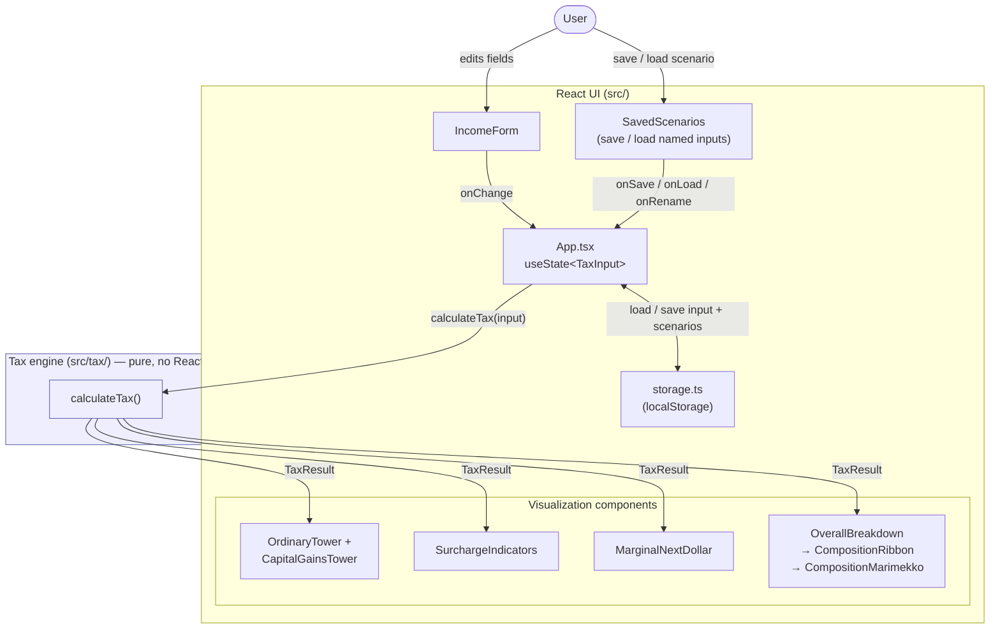
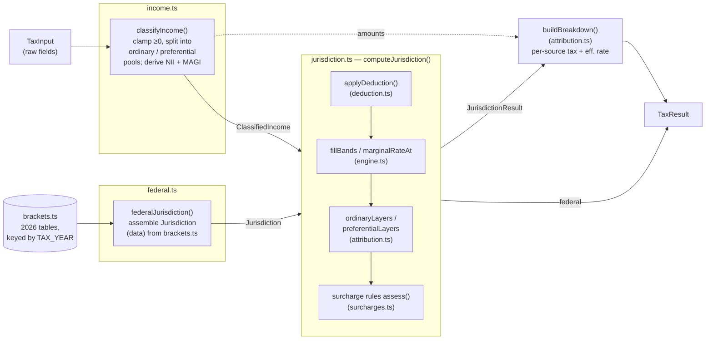

# Architecture

A single-page React app with no backend. All computation is pure, synchronous,
client-side TypeScript; the only I/O is `localStorage` for input and saved-scenario
persistence.

The design splits cleanly into two halves:

- **`src/tax/`** — a pure, framework-free tax engine. No React, no DOM. Takes a
  `TaxInput`, returns a `TaxResult`. Every module here is independently unit-tested.
- **`src/` + `src/components/`** — the React UI. Holds the input state, calls the
  engine, and renders the `TaxResult` as towers, indicators, and breakdowns.

The seam between them is two plain data types: `TaxInput` in, `TaxResult` out
(both in `src/tax/types.ts`). The UI never does tax math; the engine never
touches the DOM.

## System overview

The whole app is a pure function of the input: `App` keeps a single
`TaxInput` in state, memoizes `calculateTax(input)` into a `TaxResult`, and hands
that result to every visualization. Editing the form replaces the input, which
recomputes the result, which re-renders the views. The input — and any named
scenarios saved from it — are mirrored to `localStorage` on every change so a
reload restores them.

## The tax engine pipeline

`calculateTax` (in `calculate.ts`) is a thin orchestrator. It wires together
focused modules, each responsible for one step:

### Step by step

1. **`classifyIncome`** (`income.ts`) — normalizes raw input (negatives clamped
   to 0) and splits it into two pools: **ordinary** (wages, interest,
   non-qualified dividends, short-term gains) and **preferential** (qualified
   dividends, long-term gains). Also derives net investment income (NII) and MAGI
   for the surcharges.

2. **`federalJurisdiction`** (`federal.ts`) — assembles a `Jurisdiction`: a plain
   data object with an ordinary bracket ladder, a standard deduction, a
   preferential (0/15/20%) capital-gains ladder, and a list of surcharge rules —
   all pulled from the 2026 tables in `brackets.ts` for the given filing status.

3. **`computeJurisdiction`** (`jurisdiction.ts`) — the core. Runs the classified
   income through one jurisdiction's rules:
   - `applyDeduction` (`deduction.ts`) — deduction eats ordinary income first;
     any remainder shields preferential income proportionally.
   - `fillBands` / `marginalRateAt` (`engine.ts`) — the band arithmetic: fill an
     income range into rate bands and read off the marginal rate at a position.
     Preferential income stacks *on top* of ordinary taxable income.
   - `ordinaryLayers` / `preferentialLayers` (`attribution.ts`) — slice each
     source into taxable layers positioned in the stack, for the towers.
   - surcharge rules (`surcharges.ts`) — each `SurchargeRule` (NIIT, Additional
     Medicare) owns its `assess()`, its `marginalRate()`, and an `attribution`
     descriptor, so next-dollar behavior and per-source attribution can't drift
     from assessment.

4. **`buildBreakdown`** (`attribution.ts`) — combines per-layer income tax with
   the surcharges, attaching each surcharge's dollars per its declared
   `attribution` (Medicare → wages; NIIT distributed across investment sources)
   into a per-source amount / tax / effective-rate table.

The assembled `TaxResult` nests the federal figures under `result.federal`
(a `JurisdictionResult`) plus the cross-jurisdiction totals.

## The jurisdiction abstraction

The federal computation is modeled as one **`Jurisdiction`** — data describing
an ordinary ladder, a deduction, an optional preferential ladder, and its
surcharges. `computeJurisdiction` is generic over that data. This is deliberate
headroom: a state jurisdiction would be a second `Jurisdiction` (ordinary
brackets + deduction, usually *no* preferential ladder) computed the same way and
slotted into `TaxResult` alongside `federal`. The code that folds preferential
income into ordinary when there's no ladder already exists for that path.

## Module map

| Module | Responsibility |
|---|---|
| `tax/brackets.ts` | 2026 rate tables, deductions, thresholds — keyed by `TAX_YEAR` |
| `tax/types.ts` | Shared types: `TaxInput`, `TaxResult`, `JurisdictionResult`, etc. |
| `tax/income.ts` | Classify raw input into ordinary / preferential pools |
| `tax/federal.ts` | Assemble the federal `Jurisdiction` from the tables |
| `tax/jurisdiction.ts` | `computeJurisdiction` — run income through one jurisdiction |
| `tax/engine.ts` | Band math: `fillBands`, `taxOverRange`, `marginalRateAt` |
| `tax/deduction.ts` | Split a deduction across the two pools |
| `tax/surcharges.ts` | NIIT + Additional Medicare rules (assess + marginal) |
| `tax/attribution.ts` | Per-source layers and the combined breakdown |
| `tax/marginal.ts` | `marginalNextDollar` — cost of the next dollar by income type |
| `tax/calculate.ts` | `calculateTax` orchestrator (the engine's entry point) |
| `tax/format.ts` | Currency / percent formatting + composition segments |
| `App.tsx` | Input + scenario state, persistence, memoized compute, layout |
| `scenarios.ts` | Named input scenarios — `save` / `rename` / `remove` / list |
| `storage.ts` | `localStorage` load / save for input + scenarios |
| `components/` | Form, visualizations, and the saved-scenarios panel (see overview diagram) |

## Conventions & constraints

- **Purity.** Everything under `src/tax/` is a pure function of its arguments —
  no globals, no clock, no randomness — which is what makes the unit tests
  (`*.test.ts`) exhaustive and fast.
- **Data-driven rules.** Brackets, ladders, and surcharges are data, not
  branching logic. Adding a tax year is a copy-and-adjust in `brackets.ts`;
  adding a jurisdiction is a new `Jurisdiction` object.
- **One direction of dependency.** UI depends on the engine; the engine depends
  on nothing in `src/components/`. The `@/` alias points at `src/`.
- **Federal only.** No state tax, credits, phase-outs, or AMT — by design (see
  the disclaimer in `README.md`).
